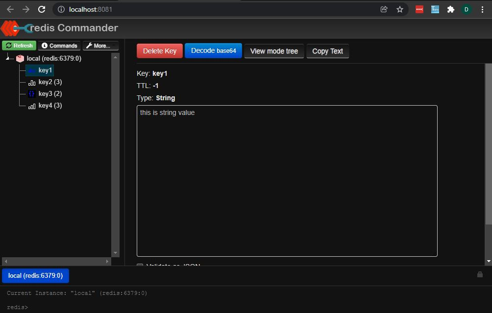

# RedisDB Connector (CSharp)
by Denny Imanuel

This mini project showcase how to connect to Redis DB using CSharp programming language.
You don't need physical database to test the code. We'll use Docker Compose to create database container.

### Requirement

1. Visual Studio / Rider IDE - You need to install Visual Studio / Rider IDE
2. Docker Desktop - You need to install Docker Desktop for Windows
3. .Net Framework - By default .Net Framework should already installed in Windows

### Run DB Container

First you need to run Redis DB container and Redis Commander container using following command:

    docker-compose up

Then you can browse Redis DB via Redis Commander portal at http://localhost:8081

In order to enter Redis Command you need to activate Redis CLI first:

    docker exec -it redis redis-cli

### Test DB Connector

Finally you can test connection to Mongo DB via following CShap connector module:

    RedisConnector.cs
